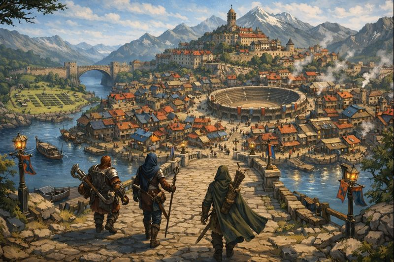

*In the world of [[Eritora]] adventure is just a river bend away.* 

### Introduction 
This wiki is designed to be a tool for you, the adventurer, to use as a reference to all things in the world of [[Eritora]]. The **Adventurer's Hub** folder is the place where the details of your adventure live. This holds session notes, character details and other information about your adventure. Each of these notes can then link to other pages within the site so that you can quickly access information about the world.

For example, say the following is a snippet from a session log:

>The party went to [[AD Venture]] to inquire about purchasing tickets on their new [[Attain]] adventure.

You can see how notes can link additional content such as items, locations, npcs and more.

You can also hover your mouse over any of the links to view the content without leaving the page. This is help for quick references on the fly. 

Players can also see the members of their party as well as links to important NPCs at the [[Adventuring Party]] page. 

# Quickest Start Checklist
Ok, ok. I get it. Sometimes all of this seems like a lot of work and you just want to go kick a goblin in its ass.

Here is a checklist to get yourself into an adventure with the minimum amount of effort:

- Join the Discord and Campaign on DnDBeyond. Info here: [[Communication Channels]]
- Create a Character: [[Character Creation]]
- Contact a DM (in Discord, text, whatever) about getting an Adventure started, or join someone else's in Discord.
- Party on!

### Getting Started
To play a game of Dungeons & Dragons, you will need a character. You will need a group to play it with. And you will need a Dungeon Master to run the adventure. There are resources available to help you do all of these things here on the wiki.

If you are a new player, here is a quick checklist to the pages you need to get started:
- [[The Quickest Start Checklist]]
- [[Communication Channels]]
- [[Character Creation]]
- [[Available Adventures]]

### Submitting Content
Every good D&D player takes notes. Using this resource there is a now a way for your notes to end up here on the Eritora wiki. During or after a session navigate to the [[Submit Content]] page where a google form lives. Fill out this google form with relevant information. You can add magic items your party found, NPC's your party met, or anything else really! By doing this you can link NPCs, magic items, weapons, locations etc. into your session notes and reference them later in the campaign as needed.

### Things to Remember When Playing D&D
**Flow comes first.** Let's play a game where things get done.
- We will keep rule arguments to a minimum
- If you have a hard time with focus, try taking notes
- Have your dice out, and character sheets available

**Immersion is King.** Let's play a game where people are immersed. 
- Respect the scene. Keep meta talk to a minimum.
- Respect the characters. Don't joke when people are roleplaying.
- Respect the ignorance. Artless exposition might be worse than focused ignorance.
- Respect the player. Players can ask for what they need, don't volunteer it unprompted. 

